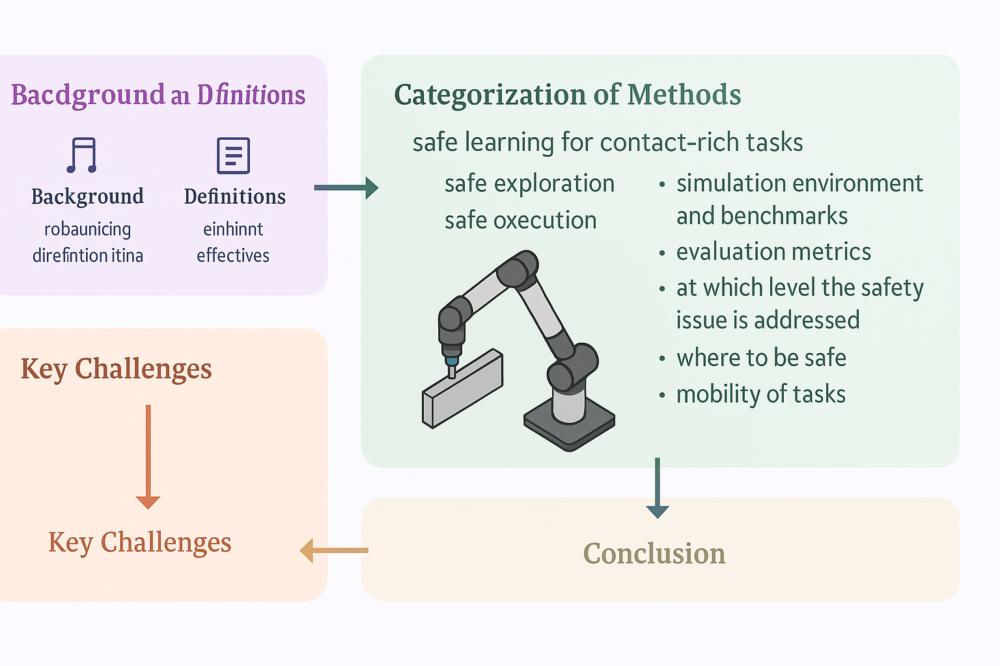

# Awesome-Learning4Safe-Contact-rich-tasks
[](https://github.com/sindresorhus/awesome)
 


[](https://github.com/jack-sherman01/Awesome-Learning4Safe-Contact-rich-tasks/blob/main/LICENSE)

Welcome to the **Awesome-Learning4Safe-Contact-rich-tasks** repository! This project collecting research papers in area of learning based methods for safe contact-rich robotics tasks. For more details, please refer to our survey paper : [Safe Learning for Contact-Rich Robot Tasks: A Survey from classical Learning-Based Methods to Safe Foundation Models](https://www.techrxiv.org/doi/full/10.36227/techrxiv.176472870.03980379/v1/) Authers: Heng Zhang,Rui Dai,Gokhan Solak,Pokuang Zhou,Yu She,Arash Ajoudani, in submission to IJRR, 2025. Any contribution is welcome!

This is a comprehensive paper collection of safe learning for contact-rich robotic tasks, aiming to contribute to the robotics and embodied AI communities. The main contributions are as below: 
<p style="text-align: justify;">
  
  <br>
  <em>Our contribution: </em>
  <br>
  <strong>A Safety-Centric Taxonomy</strong>
  We introduce a structured taxonomy that categorizes safe learning approaches based on key dimensions, including learning phase (exploration vs. execution), level of safety integration (planning, control, or end-to-end), and modalities used (force/torque, vision, etc.). This survey provides a comprehensive lens through which researchers can analyze existing methods and identify safety design trade-offs.
  <br><br>
  
  <br>
  <strong>Contextualization Within Contact-Rich Tasks</strong>
  Beyond general safe learning, we focus on its application to contact-rich robotic tasks such as insertion, polishing, and assembly. We detail how safety constraints are embedded in these tasks, and map the methods used to specific operational challenges (e.g., compliance, contact-inavatiable tasks, collision avoidance, and force control).
  <br><br>
  
  <br>
  <strong>Identification of Gaps, Challenges, and Future Directions</strong>
  We synthesize open research questions and outline critical challenges such as sim-to-real transfer under safety constraints, the scarcity of standardized benchmarks, and the need for provably safe generalization. We also discuss underexplored directions, including hybrid control-learning frameworks and human-in-the-loop safety mechanisms. Most importantly, we highlight the challenges and future opportunities in integrating safe contact-rich learning with large robotic foundation models, particularly VLM and VLA.
  <br><br>
  
</p>

## Table of Contents
- [Awesome-Learning4Safe-Contact-rich-tasks](#awesome-learning4safe-contact-rich-tasks)
  - [Table of Contents](#table-of-contents)
  - [Surveys](#surveys)
  - [Papers](#papers)
  - [News](#news)
  - [Simulation](#simulation)
  - [Benchmark](#benchmark)
  - [Cite](#cite)
  - [License](#license)

## Surveys
- [Progress and prospects of the human–robot collaboration](https://link.springer.com/article/10.1007/s10514-017-9677-2), Arash Ajoudani, Andrea Maria Zanchettin, Serena Ivaldi, Alin Albu-Schäffer, Kazuhiro Kosuge, Oussama Khatib, Autonomous Robots, 2018
- [Trends and challenges in robot manipulation](https://www.science.org/doi/10.1126/science.aat8414), Aude Billard, Danica Kragic, Science, 2019
- [A review of robot learning for manipulation: Challenges, representations, and algorithms](http://jmlr.org/papers/v22/20-1302.html), Oliver Kroemer, Scott Niekum, George Konidaris, Journal of Machine Learning Research, 2021
- [Safe Learning in Robotics: From Learning-Based Control to Safe Reinforcement Learning](https://www.annualreviews.org/content/journals/10.1146/annurev-control-042920-020211), Lukas Brunke, Melissa Greeff, Adam W. Hall, Zhaocong Yuan, Siqi Zhou, Jacopo Panerati, Angela P. Schoellig, Annual Review of Control, Robotics, and Autonomous Systems, 2022
- [A survey of robot manipulation in contact](https://www.sciencedirect.com/science/article/pii/S0921889022001312), Markku Suomalainen, Yiannis Karayiannidis, Ville Kyrki, Robotics and Autonomous Systems, 2022
- [Variable impedance control and learning—A review](https://doi.org/10.3389/frobt.2020.590681), Fares J. Abu-Dakka, Matteo Saveriano, Frontiers in Robotics and AI, 2020
- [A review on reinforcement learning for contact-rich robotic manipulation tasks](https://doi.org/10.1016/j.rcim.2023.102517), Iñigo Elguea-Aguinaco, Antonio Serrano-Muñoz, Dimitrios Chrysostomou, Ibai Inziarte-Hidalgo, Simon Bøgh, Nestor Arana-Arexolaleiba, Robotics and Computer-Integrated Manufacturing, 2023
- [Compare contact model-based control and contact model-free learning: A survey of robotic peg-in-hole assembly strategies](https://arxiv.org/abs/1904.05240), Jing Xu, Zhimin Hou, Zhi Liu, Hong Qiao, arXiv, 2019
- [Learning Control Barrier Functions and their application in Reinforcement Learning: A Survey](https://arxiv.org/abs/2404.16879), Maeva Guerrier, Hassan Fouad, Giovanni Beltrame, arXiv, 2024
- [A review of compliant mechanisms for contact robotics applications](https://www.sciencedirect.com/science/article/pii/S0921889024002860), Zahra Samadikhoshkho, Elliot Saive, Michael G. Lipsett, Robotics and Autonomous Systems, 2024
- [A Survey on Imitation Learning for Contact-Rich Tasks in Robotics](https://arxiv.org/abs/2506.13498), Toshiaki Tsuji, Yasuhiro Kato, Gokhan Solak, Heng Zhang, Tadej Petrič, Francesco Nori, Arash Ajoudani, arXiv, 2025
- [A Comprehensive Survey on Physical Risk Control in the Era of Foundation Model-enabled Robotics](https://arxiv.org/abs/2505.12583), Takeshi Kojima et al., arXiv, 2025
- [Alignment and Safety of Diffusion Models via Reinforcement Learning and Reward Modeling: A Survey](https://arxiv.org/abs/2505.17352), Preeti Lamba, Kiran Ravish, Ankita Kushwaha, Pawan Kumar, arXiv, 2025
- [Towards forceful robotic foundation models: a literature survey](https://arxiv.org/abs/2504.11827), William Xie, Nikolaus Correll, arXiv, 2025
- [State-wise safe reinforcement learning: A survey](https://arxiv.org/abs/2302.03122), Weiye Zhao, Tairan He, Rui Chen, Tianhao Wei, Changliu Liu, IJCAI, 2023
- [Shielded Reinforcement Learning: A review of reactive methods for safe learning](https://ieeexplore.ieee.org/abstract/document/10039301), Haritz Odriozola-Olalde, Maider Zamalloa, Nestor Arana-Arexolaleiba, IEEE/SICE SII, 2023
- [A Review of Safe Reinforcement Learning: Methods, Theories and Applications](https://ieeexplore.ieee.org/abstract/document/10675394), Shangding Gu, Long Yang, Yali Du, Guang Chen, Florian Walter, Jun Wang, Alois Knoll, IEEE TPAMI, 2024
- [Reinforcement learning for assembly robots: A review](https://www.proquest.com/docview/2486868134?pq-origsite=gscholar&fromopenview=true&sourcetype=Scholarly%20Journals), Liliana Stan, Adrian Florin Nicolescu, Cristina Pupăză, Proceedings in Manufacturing Systems, 2020 
- [Towards Sustainable Manufacturing: A Review on Innovations in Robotic Assembly and Disassembly](https://ieeexplore.ieee.org/abstract/document/11023241), Adip Ranjan Das, Maria Koskinopoulou, IEEE Access, 2025 
- [Data-Driven Safety Filters: Hamilton–Jacobi Reachability, Control Barrier Functions, and Predictive Methods for Uncertain Systems](https://ieeexplore.ieee.org/abstract/document/10266799), Kim P. Wabersich, Andrew J. Taylor, Jason J. Choi, Koushil Sreenath, Claire J. Tomlin, Aaron D. Ames, Melanie N. Zeilinger, IEEE Control Systems Magazine, 2023
- [Human-like dexterous manipulation for anthropomorphic five-fingered hands: A review](https://www.sciencedirect.com/science/article/pii/S2667379725000038), Yayu Huang, Dongxuan Fan, Haonan Duan, Dashun Yan, Wen Qi, Jia Sun, Qian Liu, Peng Wang, Biomimetic Intelligence and Robotics, 2025 
- [A Review of Advanced Force Torque Control Strategies for Precise Nut-to-Bolt Mating in Robotic Assembly](https://pubs2.ascee.org/index.php/IJRCS/article/view/1604)., Sy Horng Ting Terence, Yeh Huann Goh, Kar Mun Chin, Yan Kai Tan, Tsung Heng Chiew, Ge Ma, Chong Keat How, International Journal of Robotics & Control Systems, 2025
- [Robots in manufacturing: Programming, control, and safety standards](https://www.sciencedirect.com/science/chapter/edited-volume/pii/B9780443138126000117), Srinivasan Lakshminarayanan, Sreekanth Kana, Alberto De San Bernabe, Sri Harsha Turlapati, Dino Accoto, Domenico Campolo, in Digital Manufacturing (Elsevier), 2024

## Papers
<details open>
<summary>Safe Exploration</summary>
Papers in this sction are about safe exploration, especially before contact.
<details open>
<summary>Safe Execution</summary>

<details open>
<summary>highly related survey or review</summary>
<details open>
<summary>other related survey or review</summary>


## News
-

## Simulation
## Benchmark
- 

## Cite
```
bibtex
@article{
}
```
## License
MIT
