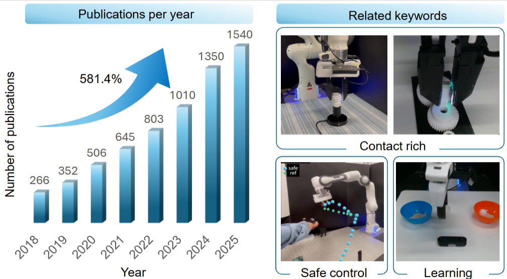
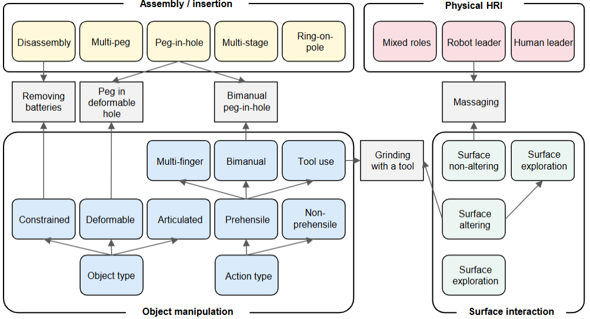
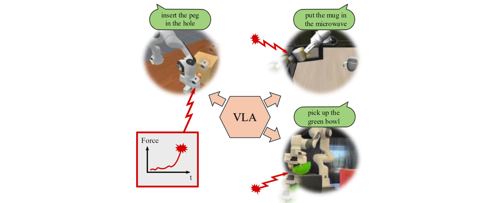

# Awesome Safe Learning for Contact-rich Robotic Tasks
[](https://github.com/sindresorhus/awesome)
 


[](https://github.com/jack-sherman01/Awesome-Learning4Safe-Contact-rich-tasks/blob/main/LICENSE)

Welcome to the **Awesome-Safe Learning for Contact-Rich Robotic Tasks** repository! This project collecting research papers in area of learning based methods for safe contact-rich robotics tasks since the last 5 years. For more details, please refer to our survey paper : [Safe Learning for Contact-Rich Robot Tasks: A Survey from classical Learning-Based Methods to Safe Foundation Models](https://www.techrxiv.org/doi/full/10.36227/techrxiv.176472870.03980379/v1/) Authers: Heng Zhang, Rui Dai, Gokhan Solak, Pokuang Zhou, Yu She, Arash Ajoudani, in submission to IJRR, 2025. Any contribution is welcome!

This is a comprehensive paper collection of safe learning for contact-rich robotic tasks, aiming to contribute to the robotics and embodied AI communities. The main contributions are as below: 
## Our contribution:
<p style="text-align: justify;">
  
  <br>

  <br>
  <strong>A Safety-Centric Taxonomy</strong>
  We introduce a structured taxonomy that categorizes safe learning approaches based on key dimensions, including learning phase (exploration vs. execution), level of safety integration (planning, control, or end-to-end), and modalities used (force/torque, vision, etc.). This survey provides a comprehensive lens through which researchers can analyze existing methods and identify safety design trade-offs.
  <br><br>
  <!--  -->
  <br>
  <strong>Contextualization Within Contact-Rich Tasks</strong>
  Beyond general safe learning, we focus on its application to contact-rich robotic tasks such as insertion, polishing, and assembly. We detail how safety constraints are embedded in these tasks, and map the methods used to specific operational challenges (e.g., compliance, contact-inavatiable tasks, collision avoidance, and force control).
  <br><br>
  
  <br>
  <strong>Identification of Gaps, Challenges, and Future Directions</strong>
  We synthesize open research questions and outline critical challenges such as sim-to-real transfer under safety constraints, the scarcity of standardized benchmarks, and the need for provably safe generalization. We also discuss underexplored directions, including hybrid control-learning frameworks and human-in-the-loop safety mechanisms. Most importantly, we highlight the challenges and future opportunities in integrating safe contact-rich learning with large robotic foundation models, particularly VLM and VLA.
  <br><br>
  
</p>

## Table of Contents
- [Awesome Safe Learning for Contact-rich Robotic Tasks](#awesome-safe-learning-for-contact-rich-robotic-tasks)
  - [Our contribution:](#our-contribution)
  - [Table of Contents](#table-of-contents)
  - [Surveys](#surveys)
  - [Papers](#papers)
    - [safe learning for contact-rich robotic tasks](#safe-learning-for-contact-rich-robotic-tasks)
    - [Contact-rich tasks](#contact-rich-tasks)
    - [Sensing And Policy Modalities](#sensing-and-policy-modalities)
    - [Data Acquisition](#data-acquisition)
    - [Safety Evaluation Metrics](#safety-evaluation-metrics)
    - [Safety Abstraction Level](#safety-abstraction-level)
    - [Safety Enforcement Spaces](#safety-enforcement-spaces)
  - [Cite](#cite)
  - [License](#license)

## Surveys
- [Progress and prospects of the human–robot collaboration](https://link.springer.com/article/10.1007/s10514-017-9677-2), Arash Ajoudani, Andrea Maria Zanchettin, Serena Ivaldi, Alin Albu-Schäffer, Kazuhiro Kosuge, Oussama Khatib, Autonomous Robots, 2018
- [Trends and challenges in robot manipulation](https://www.science.org/doi/10.1126/science.aat8414), Aude Billard, Danica Kragic, Science, 2019
- [A review of robot learning for manipulation: Challenges, representations, and algorithms](http://jmlr.org/papers/v22/20-1302.html), Oliver Kroemer, Scott Niekum, George Konidaris, Journal of Machine Learning Research, 2021
- [Safe Learning in Robotics: From Learning-Based Control to Safe Reinforcement Learning](https://www.annualreviews.org/content/journals/10.1146/annurev-control-042920-020211), Lukas Brunke, Melissa Greeff, Adam W. Hall, Zhaocong Yuan, Siqi Zhou, Jacopo Panerati, Angela P. Schoellig, Annual Review of Control, Robotics, and Autonomous Systems, 2022
- [A survey of robot manipulation in contact](https://www.sciencedirect.com/science/article/pii/S0921889022001312), Markku Suomalainen, Yiannis Karayiannidis, Ville Kyrki, Robotics and Autonomous Systems, 2022
- [Variable impedance control and learning—A review](https://doi.org/10.3389/frobt.2020.590681), Fares J. Abu-Dakka, Matteo Saveriano, Frontiers in Robotics and AI, 2020
- [A review on reinforcement learning for contact-rich robotic manipulation tasks](https://doi.org/10.1016/j.rcim.2023.102517), Iñigo Elguea-Aguinaco, Antonio Serrano-Muñoz, Dimitrios Chrysostomou, Ibai Inziarte-Hidalgo, Simon Bøgh, Nestor Arana-Arexolaleiba, Robotics and Computer-Integrated Manufacturing, 2023
- [Compare contact model-based control and contact model-free learning: A survey of robotic peg-in-hole assembly strategies](https://arxiv.org/abs/1904.05240), Jing Xu, Zhimin Hou, Zhi Liu, Hong Qiao, arXiv, 2019
- [Learning Control Barrier Functions and their application in Reinforcement Learning: A Survey](https://arxiv.org/abs/2404.16879), Maeva Guerrier, Hassan Fouad, Giovanni Beltrame, arXiv, 2024
- [A review of compliant mechanisms for contact robotics applications](https://www.sciencedirect.com/science/article/pii/S0921889024002860), Zahra Samadikhoshkho, Elliot Saive, Michael G. Lipsett, Robotics and Autonomous Systems, 2024
- [A Survey on Imitation Learning for Contact-Rich Tasks in Robotics](https://arxiv.org/abs/2506.13498), Toshiaki Tsuji, Yasuhiro Kato, Gokhan Solak, Heng Zhang, Tadej Petrič, Francesco Nori, Arash Ajoudani, arXiv, 2025
- [A Comprehensive Survey on Physical Risk Control in the Era of Foundation Model-enabled Robotics](https://arxiv.org/abs/2505.12583), Takeshi Kojima et al., arXiv, 2025
- [Alignment and Safety of Diffusion Models via Reinforcement Learning and Reward Modeling: A Survey](https://arxiv.org/abs/2505.17352), Preeti Lamba, Kiran Ravish, Ankita Kushwaha, Pawan Kumar, arXiv, 2025
- [Towards forceful robotic foundation models: a literature survey](https://arxiv.org/abs/2504.11827), William Xie, Nikolaus Correll, arXiv, 2025
- [State-wise safe reinforcement learning: A survey](https://arxiv.org/abs/2302.03122), Weiye Zhao, Tairan He, Rui Chen, Tianhao Wei, Changliu Liu, IJCAI, 2023
- [Shielded Reinforcement Learning: A review of reactive methods for safe learning](https://ieeexplore.ieee.org/abstract/document/10039301), Haritz Odriozola-Olalde, Maider Zamalloa, Nestor Arana-Arexolaleiba, IEEE/SICE SII, 2023
- [A Review of Safe Reinforcement Learning: Methods, Theories and Applications](https://ieeexplore.ieee.org/abstract/document/10675394), Shangding Gu, Long Yang, Yali Du, Guang Chen, Florian Walter, Jun Wang, Alois Knoll, IEEE TPAMI, 2024
- [Reinforcement learning for assembly robots: A review](https://www.proquest.com/docview/2486868134?pq-origsite=gscholar&fromopenview=true&sourcetype=Scholarly%20Journals), Liliana Stan, Adrian Florin Nicolescu, Cristina Pupăză, Proceedings in Manufacturing Systems, 2020 
- [Towards Sustainable Manufacturing: A Review on Innovations in Robotic Assembly and Disassembly](https://ieeexplore.ieee.org/abstract/document/11023241), Adip Ranjan Das, Maria Koskinopoulou, IEEE Access, 2025 
- [Data-Driven Safety Filters: Hamilton–Jacobi Reachability, Control Barrier Functions, and Predictive Methods for Uncertain Systems](https://ieeexplore.ieee.org/abstract/document/10266799), Kim P. Wabersich, Andrew J. Taylor, Jason J. Choi, Koushil Sreenath, Claire J. Tomlin, Aaron D. Ames, Melanie N. Zeilinger, IEEE Control Systems Magazine, 2023
- [Human-like dexterous manipulation for anthropomorphic five-fingered hands: A review](https://www.sciencedirect.com/science/article/pii/S2667379725000038), Yayu Huang, Dongxuan Fan, Haonan Duan, Dashun Yan, Wen Qi, Jia Sun, Qian Liu, Peng Wang, Biomimetic Intelligence and Robotics, 2025 
- [A Review of Advanced Force Torque Control Strategies for Precise Nut-to-Bolt Mating in Robotic Assembly](https://pubs2.ascee.org/index.php/IJRCS/article/view/1604)., Sy Horng Ting Terence, Yeh Huann Goh, Kar Mun Chin, Yan Kai Tan, Tsung Heng Chiew, Ge Ma, Chong Keat How, International Journal of Robotics & Control Systems, 2025
- [Robots in manufacturing: Programming, control, and safety standards](https://www.sciencedirect.com/science/chapter/edited-volume/pii/B9780443138126000117), Srinivasan Lakshminarayanan, Sreekanth Kana, Alberto De San Bernabe, Sri Harsha Turlapati, Dino Accoto, Domenico Campolo, in Digital Manufacturing (Elsevier), 2024

## Papers
### safe learning for contact-rich robotic tasks

<details open>
<summary>Safe Exploration</summary>
This section introduces safe learning before executing the task, highlighting its importance in ensuring reliable and risk-free performance prior to real execution.

- [The Safety Filter: A Unified View of Safety-Critical Control in Autonomous Systems](https://doi.org/10.1146/annurev-control-071723-102940), Hsu et al., Annu. Rev. Control Robot. Auton. Syst., 2024
- [Safety barrier functions and multi-camera tracking for human–robot shared environment](https://doi.org/10.1016/j.robot.2019.103388), Ferraguti et al., Rob. Auton. Syst., 2020
- [Safety and Efficiency in Robotics: The Control Barrier Functions Approach](https://doi.org/10.1109/MRA.2022.3174699), Ferraguti et al., IEEE Robot. Autom. Mag., 2022
- [Safe Navigation and Obstacle Avoidance Using Differentiable Optimization Based Control Barrier Functions](https://arxiv.org/abs/2304.08586), Dai et al., IEEE Robot. Autom. Lett., 2023
- [Robust Control Barrier Functions Using Uncertainty Estimation With Application to Mobile Robots](https://arxiv.org/abs/2401.01881), Das & Burdick, arXiv, 2024
- [Robust Safe Learning and Control in an Unknown Environment: An Uncertainty-Separated Control Barrier Function Approach](https://doi.org/10.1109/LRA.2023.3309130), Li et al., IEEE Robot. Autom. Lett., 2023
- [Safe and Robust Motion Planning for Dynamic Robotics via Control Barrier Functions](https://doi.org/10.1109/CDC45484.2021.9682803), Manjunath & Nguyen, IEEE CDC, 2021
- [Flow shop scheduling with human–robot collaboration: a joint chance-constrained programming approach](https://doi.org/10.1080/00207543.2023.2181025), Wang & Zhang, Int. J. Prod. Res., 2024
- [Probabilistic Collision Checking With Chance Constraints](https://doi.org/10.1109/TRO.2011.2116190), Du Toit & Burdick, IEEE Trans. Robot., 2011
- [Solving Chance-Constrained Stochastic Programs via Sampling and Integer Programming](https://doi.org/10.1287/educ.1080.0048), Ahmed & Shapiro, in *State-of-the-Art Decision-Making Tools in the Information-Intensive Age*, 2008
- [Safe Human–Robot Collaboration With Risk Tunable Control Barrier Functions](https://doi.org/10.1109/TMECH.2025.3572047), Sharma et al., IEEE/ASME Trans. Mechatron., 2025
</details>

<details open>
<summary>Safe Execution</summary>
Safe execution is crucial in contact-rich robotic tasks, as robots must interact not only with complex and uncertain environments but often also in close proximity to humans . This section focuses on learning methods that ensure safety during the execution of contact-rich tasks, addressing challenges such as safe contact, force control, and compliance.

- [Safe robot execution in model-based reinforcement learning](https://ieeexplore.ieee.org/abstract/document/7354232), Martínez et al., IEEE/RSJ IROS, 2015
- [Reinforcement learning on variable impedance controller for high-precision robotic assembly](https://ieeexplore.ieee.org/abstract/document/8793506), Luo et al., IEEE ICRA, 2019
- [Robotic assembly control reconfiguration based on transfer reinforcement learning for objects with different geometric features](http://dx.doi.org/10.1016/j.engappai.2023.107576), Gai et al., Engineering Applications of Artificial Intelligence, 2024
- [Meta reinforcement learning for robust and adaptable robotic assembly tasks](http://dx.doi.org/10.1109/icces54031.2021.9686128), Hafez et al., IEEE ICCES, 2021
- [Reinforcement learning for assembly robots: A review](https://www.proquest.com/docview/2486868134), Stan et al., Proceedings in Manufacturing Systems, 2020
- [Variable impedance skill learning for contact-rich manipulation](https://ieeexplore.ieee.org/abstract/document/9812508), Yang et al., IEEE Robotics and Automation Letters, 2022
- [Impedance learning-based adaptive control for human–robot interaction](https://ieeexplore.ieee.org/abstract/document/9531394), Sharifi et al., IEEE Transactions on Control Systems Technology, 2021
- [Safety compliant control for robotic manipulator with task and input constraints](https://ieeexplore.ieee.org/abstract/document/9802700), Murtaza et al., IEEE Robotics and Automation Letters, 2022
- [Adaptive admittance control for safety-critical physical human robot collaboration](https://doi.org/10.1016/j.ifacol.2023.10.1772), Sun et al., IFAC-PapersOnLine, 2023
- [Adaptive admittance control for physical human-robot interaction based on imitation and reinforcement learning](https://doi.org/10.1109/m2vip58386.2023.10413438), Guo et al., IEEE M2VIP, 2023
- [A perturbation-robust framework for admittance control of robotic systems with high-stiffness contacts and heavy payload](https://doi.org/10.1109/lra.2024.3406055), Samuel et al., IEEE Robotics and Automation Letters, 2024
- [A review of compliant mechanisms for contact robotics applications](https://www.sciencedirect.com/science/article/pii/S0921889024002860), Samadikhoshkho et al., Robotics and Autonomous Systems, 2025
- [Learning for contact-rich tasks with cobots](https://lup.lub.lu.se/student-papers/search/publication/9120389), Cruz-Oliver, Master's thesis, 2024
- [A survey of optimization-based task and motion planning: From classical to learning approaches](https://ieeexplore.ieee.org/abstract/document/10705419), Zhao et al., IEEE/ASME Transactions on Mechatronics, 2024
- [SRL-VIC: A variable stiffness-based safe reinforcement learning for contact-rich robotic tasks](https://ieeexplore.ieee.org/abstract/document/10517382), Zhang et al., IEEE Robotics and Automation Letters, 2024


</details>

<details open>
<summary>Provable Safety Methods</summary>

- [Safe and Optimal Variable Impedance Control via Certified Reinforcement Learning](http://arxiv.org/abs/2511.16330), Kumar et al., arXiv, 2025
- [Data-Driven Safety Filters: Hamilton–Jacobi Reachability, Control Barrier Functions, and Predictive Methods for Uncertain Systems](https://ieeexplore.ieee.org/abstract/document/10266799), Wabersich et al., IEEE Control Systems Magazine, 2023
- [An Actor-Critic Learning Framework Based on Lyapunov Stability for Automatic Assembly](https://link.springer.com/article/10.1007/s10489-022-03844-2), Li et al., Applied Intelligence, 2023
- [Deep Reinforcement Learning-Based Variable Impedance Control for Grinding Workpieces with Complex Geometry](https://www.emerald.com/insight/content/doi/10.1108/RIA-09-2024-0207), Li et al., Robotic Intelligence and Automation, 2025
- [Impedance Learning-Based Adaptive Force Tracking for Robot on Unknown Terrains](https://ieeexplore.ieee.org/document/10842469), Li et al., IEEE Transactions on Robotics, 2025
- [Contact-Aware Safety in Soft Robots Using High-Order Control Barrier and Lyapunov Functions](https://arxiv.org/abs/2505.03841), Wong et al., arXiv, 2025
- [High-Order Control Barrier Functions-Based Impedance Control of a Robotic Manipulator with Time-Varying Output Constraints](https://www.sciencedirect.com/science/article/abs/pii/S0019057822000726), Wang et al., ISA Transactions, 2022

</details>

<details open>
<summary>Safe foundation models</summary>
Foundation Models & General Large Models (e.g., VLMs, VLAs) have shown great potential in robotics, but ensuring their safety in contact-rich tasks remains a significant challenge. This section explores recent advancements in integrating safety mechanisms into foundation models for robotic applications.

**surveys on safe foundation models:**
  
- [Towards safe robot foundation models](https://arxiv.org/abs/2503.07404), Tölle et al., arXiv, 2025
- [Towards forceful robotic foundation models: a literature survey](https://arxiv.org/abs/2504.11827), Xie & Correll, arXiv, 2025
- [A Comprehensive Survey on Physical Risk Control in the Era of Foundation Model-enabled Robotics](https://arxiv.org/abs/2505.12583), Kojima et al., arXiv, 2025
- [Towards embodied agentic AI: Review and classification of LLM-and VLM-driven robot autonomy and interaction](https://arxiv.org/abs/2508.05294), Salimpour et al., arXiv, 2025
  
  
**Recent Safe Foundation Models for Contact-Rich Tasks:**
  
- [SafeVLA: Towards Safety Alignment of Vision-Language-Action Model via Constrained Learning](https://arxiv.org/abs/2503.03480), Zhang et al., arXiv, 2025
- [VTLA: Vision-Tactile-Language-Action Model with Preference Learning for Insertion Manipulation](https://arxiv.org/abs/2505.09577), Zhang et al., arXiv, 2025
- [Audio-VLA: Adding Contact Audio Perception to Vision-Language-Action Model for Robotic Manipulation](https://arxiv.org/abs/2511.09958), Wei et al., arXiv, 2025
- [SAFE: Multitask Failure Detection for Vision-Language-Action Models](https://arxiv.org/abs/2506.09937), Gu et al., arXiv, 2025
- [ImpedanceGPT: VLM-driven Impedance Control of Swarm of Mini-drones for Intelligent Navigation in Dynamic Environment](https://arxiv.org/abs/2503.02723), Batool et al., arXiv, 2025
- [PhysVLM: Enabling Visual Language Models to Understand Robotic Physical Reachability](https://arxiv.org/abs/2503.08481), Zhou et al., arXiv, 2025
- [MLA: A Multisensory Language-Action Model for Multimodal Understanding and Forecasting in Robotic Manipulation](http://arxiv.org/abs/2509.26642), Liu et al., arXiv, 2025


**Language Conditioned / Text-Guided / LLM Agents for Contact-Rich Tasks:**

- [SayCan: Grounding Language in Robotic Affordances](https://arxiv.org/abs/2204.01691), Ahn et al., arXiv, 2022
- [RT-2: Vision-Language-Action Model for Robotic Manipulation](https://arxiv.org/abs/2307.15818), Ahn et al., arXiv, 2023
- [SafeAgentBench: A benchmark for safe task planning of embodied LLM agents](https://arxiv.org/abs/2412.13178), Yin et al., arXiv, 2024
- [Text2Interaction: Establishing Safe and Preferable Human-Robot Interaction](https://arxiv.org/abs/2408.06105), Thumm et al., CoRL, 2024
- [CALAMARI: Contact-aware and language conditioned spatial action MApping for contact-RIch manipulation](https://proceedings.mlr.press/v229/wi23a.html), Wi et al., arXiv, 2023
- [Updating Robot Safety Representations Online From Natural Language Feedback](https://arxiv.org/abs/2409.14580), Santos et al., arXiv, 2025
- [Toward Automated Programming for Robotic Assembly Using ChatGPT](https://arxiv.org/abs/2405.08216), Macaluso et al., arXiv, 2024
- [Learning a High-Quality Robotic Wiping Policy Using Systematic Reward Analysis and Visual-Language Model Based Curriculum](https://arxiv.org/abs/2502.12599), Liu et al., arXiv, 2025
- [OmniVIC: A Self-Improving Variable Impedance Controller with Vision-Language In-Context Learning for Safe Robotic Manipulation](https://arxiv.org/abs/2510.17150), Zhang et al., arXiv, 2025
- [Text to Robotic Assembly of Multi Component Objects using 3D Generative AI and Vision Language Models](https://arxiv.org/abs/2511.02162), Alexander Htet Kyaw et al., arXiv, 2025

</details>

### Contact-rich tasks

<details open>
<summary>Assembly and Insertion</summary>

**Learning-Based Assembly**
- [Reinforcement learning on variable impedance controller for high-precision robotic assembly](https://ieeexplore.ieee.org/abstract/document/8793506), Luo et al., IEEE ICRA, 2019
- [Meta reinforcement learning for robust and adaptable robotic assembly tasks](http://dx.doi.org/10.1109/icces54031.2021.9686128), Hafez et al., IEEE ICCES, 2021
- [Robotic assembly control reconfiguration based on transfer reinforcement learning for objects with different geometric features](https://www.sciencedirect.com/science/article/abs/pii/S0952197623017608), Gai et al., Engineering Applications of Artificial Intelligence, 2024
- [Skill learning for robotic insertion based on one-shot demonstration and reinforcement learning](https://link.springer.com/article/10.1007/s11633-020-1261-0), Li & Xu, International Journal of Automation and Computing, 2021
- [An actor-critic learning framework based on Lyapunov stability for automatic assembly](https://link.springer.com/article/10.1007/s10489-022-03844-2), Li et al., Applied Intelligence, 2023
- [Learning contact-rich assembly skills using residual admittance policy](https://ieeexplore.ieee.org/abstract/document/9636023), Spector & Zacksenhouse, IEEE/RSJ IROS, 2021
- [Insertionnet-a scalable solution for insertion](https://ieeexplore.ieee.org/abstract/document/9476636), Spector & Di Castro, IEEE Robotics and Automation Letters, 2021
- [Meta-reinforcement learning for robotic industrial insertion tasks](https://ieeexplore.ieee.org/abstract/document/9341094), Schoettler et al., IEEE/RSJ IROS, 2020
- [Fuzzy logic-driven variable time-scale prediction-based reinforcement learning for robotic multiple peg-in-hole assembly](https://ieeexplore.ieee.org/abstract/document/9250533), Hou et al., IEEE Transactions on Automation Science and Engineering, 2020
- [Multiple peg-in-hole compliant assembly based on a learning-accelerated deep deterministic policy gradient strategy](https://www.emerald.com/insight/content/doi/10.1108/IR-05-2021-0095/full/html), Li et al., Industrial Robot, 2022
- [Variable compliance control for robotic peg-in-hole assembly: A deep-reinforcement-learning approach](https://www.mdpi.com/2076-3417/10/19/6923), Beltran-Hernandez et al., Applied Sciences, 2020
- [Learning force control for contact-rich manipulation tasks with rigid position-controlled robots](https://ieeexplore.ieee.org/document/9145608), Beltran-Hernandez et al., IEEE Robotics and Automation Letters, 2020
- [Robotic imitation of human assembly skills using hybrid trajectory and force learning](https://ieeexplore.ieee.org/abstract/document/9561619), Wang et al., IEEE ICRA, 2021
- [Hybrid trajectory and force learning of complex assembly tasks: A combined learning framework](https://ieeexplore.ieee.org/abstract/document/9420285), Wang et al., IEEE Access, 2021
- [IndustReal: Transferring Contact-Rich Assembly Tasks from Simulation to Reality](http://dx.doi.org/10.15607/rss.2023.xix.039), Tang et al., RSS, 2023
- [Offline Meta-Reinforcement Learning for Industrial Insertion](https://ieeexplore.ieee.org/abstract/document/9812312), Zhao et al., IEEE ICRA, 2022
- [A sim-to-real learning-based framework for contact-rich assembly by utilizing cyclegan and force control](https://ieeexplore.ieee.org/abstract/document/10025827), Shi et al., IEEE Transactions on Cognitive and Developmental Systems, 2023
- [Efficient sim-to-real transfer of contact-rich manipulation skills with online admittance residual learning](https://proceedings.mlr.press/v229/zhang23c.html), Zhang et al., CoRL, 2023
- [Safe peg-in-hole automatic assembly using virtual guiding force: A deep reinforcement learning solution](https://www.sciencedirect.com/science/article/abs/pii/S0921889024002781), Zang et al., Robotics and Autonomous Systems, 2025
- [Deep reinforcement learning on variable stiffness compliant control for programming-free robotic assembly in smart manufacturing](https://ideas.repec.org/a/taf/tprsxx/v62y2024i19p7073-7095.html), Ji et al., International Journal of Production Research, 2024
- [Deep Reinforcement Learning of Robotic Precision Insertion Skill Accelerated by Demonstrations](https://ieeexplore.ieee.org/abstract/document/8842940), Wu et al., IEEE CASE, 2019
- [Reinforcement Learning for Robotic Assembly Using Non-Diagonal Stiffness Matrix](https://ieeexplore.ieee.org/abstract/document/9361113), Oikawa et al., IEEE Robotics and Automation Letters, 2021
- [Learning Robotic Assembly from CAD](https://ieeexplore.ieee.org/abstract/document/8460696), Thomas et al., IEEE ICRA, 2018
- [Generating Manipulation Sequences using Reinforcement Learning and Behavior Trees for Peg-In-Hole Task](https://ieeexplore.ieee.org/abstract/document/9945269), Xu et al., IEEE SMC, 2022
- [Robotic Peg-in-Hole Assembly Strategy Research Based on Reinforcement Learning Algorithm](https://www.mdpi.com/2076-3417/12/21/11149), Li et al., Applied Sciences, 2022
- [Learning Assembly Tasks in a Few Minutes by Combining Impedance Control and Residual Recurrent Reinforcement Learning](https://onlinelibrary.wiley.com/doi/full/10.1002/aisy.202100095), Kulkarni et al., Advanced Intelligent Systems, 2021
- [Data-efficient hierarchical reinforcement learning for robotic assembly control applications](https://ieeexplore.ieee.org/abstract/document/9205674), Hou et al., IEEE Transactions on Industrial Electronics, 2020
- [Active compliance control of robot peg-in-hole assembly based on combined reinforcement learning](https://link.springer.com/article/10.1007/s10489-023-05156-5), Chen et al., Applied Intelligence, 2023
- [An Adaptive Imitation Learning Framework for Robotic Complex Contact-Rich Insertion Tasks](https://www.frontiersin.org/articles/10.3389/frobt.2021.777363/full), Wang et al., Frontiers in Robotics and AI, 2022
- [Generalizable Human-Robot Collaborative Assembly Using Imitation Learning and Force Control](https://arxiv.org/pdf/2212.01434), Jha et al., ECC, 2023
- [Contact-Rich Object Insertion: Lessons for Zero-Shot Policy Transfer](https://openreview.net/forum?id=OhJTFH1zLZ), Brahmbhatt et al., ICRA Workshop, 2023
- [Learning tactile insertion in the real world](https://arxiv.org/abs/2405.00383), Palenicek et al., arXiv, 2024

**Multimodal and Force-Based Assembly**
- [Multimodality Driven Impedance-Based Sim2Real Transfer Learning for Robotic Multiple Peg-in-Hole Assembly](https://ieeexplore.ieee.org/document/10251991), Chen et al., IEEE Transactions on Cybernetics, 2024
- [Generalize by touching: Tactile ensemble skill transfer for robotic furniture assembly](https://arxiv.org/abs/2404.17684), Lin et al., IEEE ICRA, 2024
- [Robust multi-modal policies for industrial assembly via reinforcement learning and demonstrations: A large-scale study](https://arxiv.org/abs/2103.11512), Luo et al., arXiv, 2021
- [Deep reinforcement learning for robotic assembly of mixed deformable and rigid objects](https://ieeexplore.ieee.org/document/8594353), Luo et al., IEEE/RSJ IROS, 2018
- [Multimodal Task Attention Residual Reinforcement Learning: Advancing Robotic Assembly in Unstructured Environment](https://ieeexplore.ieee.org/document/10909176), Lin et al., IEEE Robotics and Automation Letters, 2025
- [RoboMT: Human-Like Compliance Control for Assembly via a Bilateral Robotic Teleoperation and Hybrid Mamba-Transformer Framework](https://ieeexplore.ieee.org/document/11037245), Rundong et al., IEEE Robotics and Automation Letters, 2025


**Sim-to-Real Transfer for Assembly**
- [Bridging the Sim-to-Real Gap with Dynamic Compliance Tuning for Industrial Insertion](https://arxiv.org/abs/2311.07499), Zhang et al., IEEE ICRA, 2024
- [Sim-to-Real Transfer of Robotic Assembly with Visual Inputs Using CycleGAN and Force Control](https://ieeexplore.ieee.org/document/10011878), Yuan et al., IEEE ROBIO, 2022
- [TRANS-AM: Transfer Learning by Aggregating Dynamics Models for Soft Robotic Assembly](https://ieeexplore.ieee.org/abstract/document/9561081), Tanaka et al., IEEE ICRA, 2021


**Physics-Based Assembly Planning**
- [Assemble them all: Physics-based planning for generalizable assembly by disassembly](https://dl.acm.org/doi/abs/10.1145/3550454.3555525), Tian et al., ACM Transactions on Graphics, 2022
- [Factory: Fast contact for robotic assembly](https://arxiv.org/abs/2205.03532), Narang et al., arXiv, 2022
- [RoboAssembly: Learning generalizable furniture assembly policy in a novel multi-robot contact-rich simulation environment](https://arxiv.org/abs/2112.10143), Yu et al., arXiv, 2021
- [Multi-level Reasoning for Robotic Assembly: From Sequence Inference to Contact Selection](https://arxiv.org/abs/2312.10571), Zhu et al., IEEE ICRA, 2024

**Human-Robot Collaborative Assembly**
- [Task-oriented safety field for robot control in human-robot collaborative assembly based on residual learning](https://www.sciencedirect.com/science/article/abs/pii/S095741742302448X), Zhu et al., Expert Systems with Applications, 2024
- [A flexible manufacturing assembly system with deep reinforcement learning](https://www.sciencedirect.com/science/article/pii/S0967066121002525), Li et al., Control Engineering Practice, 2022
- [Deep Reinforcement Learning for Real-Time Assembly Planning in Robot-Based Prefabricated Construction](https://ieeexplore.ieee.org/abstract/document/10015730), Zhu et al., IEEE Transactions on Automation Science and Engineering, 2023

**LLM/VLM-Guided Assembly**
- [Toward Automated Programming for Robotic Assembly Using ChatGPT](https://arxiv.org/html/2405.08216v1), Macaluso et al., IEEE ICRA, 2024
- [Text to Robotic Assembly of Multi Component Objects using 3D Generative AI and Vision Language Models](https://arxiv.org/html/2511.02162v2), Kyaw et al., arXiv, 2025
- [CALAMARI: Contact-aware and language conditioned spatial action MApping for contact-RIch manipulation](https://proceedings.mlr.press/v229/wi23a.html), Wi et al., CoRL, 2023
- [Query-Centric Diffusion Policy for Generalizable Robotic Assembly](https://arxiv.org/abs/2509.18686), Xu et al., arXiv, 2025

**Disassembly Tasks**
- [Robotic disassembly task training and skill transfer using reinforcement learning](https://ieeexplore.ieee.org/abstract/document/10097918), Qu et al., IEEE Transactions on Industrial Informatics, 2023
- [Learning and generalising object extraction skill for contact-rich disassembly tasks: an introductory study](https://link.springer.com/article/10.1007/s00170-022-10670-6), Serrano-Munoz et al., The International Journal of Advanced Manufacturing Technology, 2023
- [Goal-Conditioned Reinforcement Learning within a Human-Robot Disassembly Environment](https://www.mdpi.com/2076-3417/12/22/11610), Elguea-Aguinaco et al., Applied Sciences, 2022

**Impedance/Compliance Control for Assembly**
- [Knowledge-guided robot learning on compliance control for robotic assembly task with predictive model](https://www.sciencedirect.com/science/article/pii/S0957417423019826), Liu et al., Expert Systems with Applications, 2023
- [SCAPE: Learning stiffness control from augmented position control experiences](https://proceedings.mlr.press/v164/kim22b.html), Kim et al., CoRL, 2022
- [Optimizing Non-diagonal Stiffness Matrix of Compliance Control for Robotic Assembly Using Deep Reinforcement Learning](https://iopscience.iop.org/article/10.1088/1742-6596/2402/1/012013), Liu et al., Journal of Physics: Conference Series, 2022
- [Fast skill learning for variable compliance robotic assembly](https://arxiv.org/abs/1905.04427), Ren et al., arXiv, 2019
- [Compliant Robotic Assembly based on Deep Reinforcement Learning](https://ieeexplore.ieee.org/abstract/document/9529475), Zhou et al., IEEE MLISE, 2021

**Hierarchical and Structured Learning for Assembly**
- [A Hierarchical Compliance-Based Contextual Policy Search for Robotic Manipulation Tasks With Multiple Objectives](https://ieeexplore.ieee.org/abstract/document/9841405), Hou et al., IEEE Transactions on Industrial Informatics, 2023
- [Hierarchical Reinforcement Learning Integrating With Human Knowledge for Practical Robot Skill Learning in Complex Multi-Stage Manipulation](https://ieeexplore.ieee.org/document/10184998), Liu et al., IEEE Transactions on Automation Science and Engineering, 2024
- [SHaRe-RL: Structured, Interactive Reinforcement Learning for Contact-Rich Industrial Assembly Tasks](https://arxiv.org/html/2509.13949v1), Stranghöner et al., arXiv, 2025
</details>

<details open>
<summary>Surface Interaction</summary>

- [CHEQ-ing the Box: Safe Variable Impedance Learning for Robotic Polishing](https://arxiv.org/abs/2501.07985), Cramer et al., arXiv, 2025
- [Deep reinforcement learning-based variable impedance control for grinding workpieces with complex geometry](https://www.emerald.com/insight/content/doi/10.1108/RIA-09-2024-0207), Li et al., Robotic Intelligence and Automation, 2024
- [A Contact Model based on Denoising Diffusion to Learn Variable Impedance Control for Contact-rich Manipulation](https://arxiv.org/abs/2403.13221), Okada et al., arXiv, 2024
- [Adaptive Compliance Policy: Learning Approximate Compliance for Diffusion Guided Control](https://ieeexplore.ieee.org/abstract/document/11128452), Hou et al., IEEE International Conference on Robotics and Automation (ICRA), 2025
- [Learning Diffusion Policies from Demonstrations For Compliant Contact-rich Manipulation](https://arxiv.org/abs/2410.19235), Aburub et al., arXiv (preprint), 2024
- [Safe contact-based robot active search using Bayesian optimization and control barrier functions](https://www.frontiersin.org/articles/10.3389/frobt.2024.1344367), Vinter-Hviid et al., Frontiers in Robotics and AI, 2024 
- [A Passivity-Based Variable Impedance Controller for Incremental Learning of Periodic Interactive Tasks](https://arxiv.org/abs/2408.10580), Dalle-Vedove et al., arXiv (preprint), 2024
- [Adaptive Neural Network Force Tracking Control of Flexible Joint Robot With an Uncertain Environment](https://ieeexplore.ieee.org/abstract/document/10173753/), Xinbo et al., IEEE Transactions on Industrial Electronics, 2024 
- [Impedance control and parameter optimization of surface polishing robot based on reinforcement learning](https://journals.sagepub.com/doi/abs/10.1177/09544054221100004), Ding et al., Journal of Engineering Manufacture, 2022
- [A Contact-Safe Reinforcement Learning Framework for Contact-Rich Robot Manipulation](https://ieeexplore.ieee.org/abstract/document/9981185/), Zhu et al., IROS, 2022
- [Online Optimization Method of Controller Parameters for Robot Constant Force Grinding Based on Deep Reinforcement Learning Rainbow](https://link.springer.com/article/10.1007/s10846-022-01688-z), Zhang et al., Journal of Intelligent & Robotic Systems, 2022 
- [Uncertainty-Aware Contact-Safe Model-Based Reinforcement Learning](https://ieeexplore.ieee.org/abstract/document/9376242), Kuo et al., IEEE Robotics and Automation Letters, 2021
- [Safe Online Gain Optimization for Cartesian Space Variable Impedance Control](https://ieeexplore.ieee.org/abstract/document/9926697), Wang et al., IEEE CASE, 2022
- [Model-Free Adaptive Impedance Control for Autonomous Robotic Sanding](https://ieeexplore.ieee.org/abstract/document/9618655), Huo et al., IEEE TASE, 2021
- [Variable Impedance Control in End-Effector Space: An Action Space for Reinforcement Learning in Contact-Rich Tasks](https://ieeexplore.ieee.org/abstract/document/8968201), Martín-Martín et al., IEEE/RSJ IROS, 2019


</details>

<details open>
<summary>Object Manipulation</summary>

- [A review on reinforcement learning for contact-rich robotic manipulation tasks](https://doi.org/10.1016/j.rcim.2023.102517), Elguea-Aguinaco et al., Robotics and Computer-Integrated Manufacturing, 2023
- [A Survey on Imitation Learning for Contact-Rich Tasks in Robotics](https://arxiv.org/abs/2506.13498), Tsuji et al., arXiv, 2025
- [Variable impedance skill learning for contact-rich manipulation](https://ieeexplore.ieee.org/abstract/document/9812508), Yang et al., IEEE Robotics and Automation Letters, 2022
- [Learning force control for contact-rich manipulation tasks with rigid position-controlled robots](), Beltran-Hernandez et al., IEEE Robotics and Automation Letters, 2020
- [SRL-VIC: A variable stiffness-based safe reinforcement learning for contact-rich robotic tasks](http://dx.doi.org/10.1109/LRA.2024.3396368), Zhang et al., IEEE Robotics and Automation Letters, 2024
- [A Contact-Safe Reinforcement Learning Framework for Contact-Rich Robot Manipulation](https://ieeexplore.ieee.org/document/9981185), Zhu et al., IEEE/RSJ IROS, 2022
- [Learning Diffusion Policies from Demonstrations For Compliant Contact-rich Manipulation](https://arxiv.org/abs/2410.19235), Aburub et al., arXiv, 2024
- [Should We Learn Contact-Rich Manipulation Policies From Sampling-Based Planners?](http://dx.doi.org/10.1109/lra.2025.3564701), Zhu et al., IEEE Robotics and Automation Letters, 2025
- [CALAMARI: Contact-aware and language conditioned spatial action MApping for contact-RIch manipulation](https://proceedings.mlr.press/v229/wi23a.html), Wi et al., CoRL, 2023
- [Human-like dexterous manipulation for anthropomorphic five-fingered hands: A review](https://link.springer.com/chapter/10.1007/978-981-99-6492-5_27), Huang et al., Biomimetic Intelligence and Robotics, 2025
- [Safe robot execution in model-based reinforcement learning](https://ieeexplore.ieee.org/document/7354295), Martínez et al., IEEE/RSJ IROS, 2015
- [Safety compliant control for robotic manipulator with task and input constraints](https://ieeexplore.ieee.org/document/9785709), Murtaza et al., IEEE Robotics and Automation Letters, 2022
- [Motion planner augmented reinforcement learning for robot manipulation in obstructed environments](https://arxiv.org/abs/2010.11940), Yamada et al., CoRL, 2021
- [OmniVIC: A Self-Improving Variable Impedance Controller with Vision-Language In-Context Learning for Safe Robotic Manipulation](https://arxiv.org/abs/2510.17150), Zhang et al., arXiv, 2025
- [Safe data-driven contact-rich manipulation](https://ieeexplore.ieee.org/document/9555680), Mitsioni et al., IEEE Humanoids, 2021

</details>

<details open>
<summary>Physical HRI</summary>

- [A Learning Control Strategy for Robot-assisted Bathing via Impedance Sliding Mode Technique With Non-repetitive Tasks](https://link.springer.com/article/10.1007/s12555-022-0436-6), Xu et al., International Journal of Control, Automation and Systems, 2024
- [Force-Constrained Visual Policy: Safe Robot-Assisted Dressing via Multi-Modal Sensing](https://ieeexplore.ieee.org/abstract/document/10465608/), Sun et al., IEEE Robotics and Automation Letters, 2024
- [Task-oriented safety field for robot control in human-robot collaborative assembly based on residual learning](https://www.sciencedirect.com/science/article/pii/S095741742302448X), Zhu et al., Expert Systems with Applications, 2024
- [Impedance learning for human-guided robots in contact with unknown environments](https://ieeexplore.ieee.org/abstract/document/10160165/), Xing et al., IEEE Transactions on Robotics, 2023
- Study on force control for robot massage with a model-based reinforcement learning algorithm
, Xiao et al., Intelligent Service Robotics, 2023
- [Research on Robot Massage Force Control Based on Residual Reinforcement Learning](https://ieeexplore.ieee.org/abstract/document/10374025/), Xiao et al., IEEE Access, 2024
- [Impedance Learning-Based Adaptive Control for Human–Robot Interaction](https://ieeexplore.ieee.org/abstract/document/9531394), Sharifi et al., IEEE Transactions on Control Systems Technology, 2021
- [Learning Variable Impedance Control for Robotic Massage With Deep Reinforcement Learning: A Novel Learning Framework](https://ieeexplore.ieee.org/abstract/document/10385222/), Li et al., IEEE Systems, Man, and Cybernetics Magazine, 2024
- [Text2Interaction: Establishing Safe and Preferable Human-Robot Interaction](https://arxiv.org/abs/2408.06105), Thumm et al., Conference on Robot Learning (CoRL), 2024
- [The path towards contact-based physical human–robot interaction](https://www.sciencedirect.com/science/article/pii/S0921889024002136), Farajtabar et al., Robotics and Autonomous Systems, 2024
- [A human-centered safe robot reinforcement learning framework with interactive behaviors](https://www.frontiersin.org/journals/neurorobotics/articles/10.3389/fnbot.2023.1280341), Gu et al., Frontiers in Neurorobotics, 2023
- [Q-Learning-based model predictive variable impedance control for physical human-robot collaboration](https://www.sciencedirect.com/science/article/pii/S0004370222001114), Roveda et al., Artificial Intelligence, 2022 
- [Adaptive Safety-Critical Control With Uncertainty Estimation for Human–Robot Collaboration](https://ieeexplore.ieee.org/abstract/document/10281398), Zhang et al., IEEE TASE, 2023
- [Model-Based Actor-Critic Learning of Robotic Impedance Control in Complex Interactive Environment](https://ieeexplore.ieee.org/abstract/document/9652099), Zhao et al., IEEE Transactions on Industrial Electronics, 2021
- [Assistive Gym: A Physics Simulation Framework for Assistive Robotics](https://ieeexplore.ieee.org/abstract/document/9197411), Erickson et al., IEEE International Conference on Robotics and Automation (ICRA), 2020


</details>

<details open>
<summary>Other tasks</summary>
</details>

### Sensing And Policy Modalities

<details open>
<summary>Pose and Proprioceptive</summary> 

- [Safe data-driven model predictive control of systems with complex dynamics](https://ieeexplore.ieee.org/document/10113472), Mitsioni et al., IEEE Transactions on Robotics, 2023
- [Robotic imitation of human assembly skills using hybrid trajectory and force learning](https://ieeexplore.ieee.org/abstract/document/9561619?casa_token=VZzClSLo7QQAAAAA:tFOqQs205sGzNHtY1jXleAmQt5SWFz0AO8oDw2RM5EmaSZ_DvmGsLFlC8S3a5cP1yjeiXUDH4WTuFA), Wang et al., IEEE International Conference on Robotics and Automation (ICRA), 2021
- [Should We Learn Contact-Rich Manipulation Policies From Sampling-Based Planners?](https://ieeexplore.ieee.org/abstract/document/10977833?casa_token=BOv75ETm9EgAAAAA:z9ua-iCXwUimmjC_S-RUx4uG8TcfpN_jCOagosS49cckeyPCUIU_r6PE4pUet4pAVgPuq_tMJcjTSA), Zhu et al., IEEE Robotics and Automation Letters, 2025
- [Diffusion forcing: Next-token prediction meets full-sequence diffusion](https://proceedings.neurips.cc/paper_files/paper/2024/hash/2aee1c4159e48407d68fe16ae8e6e49e-Abstract-Conference.html), Chen et al., Advances in Neural Information Processing Systems, 2024
- [Handling long-term safety and uncertainty in safe reinforcement learning](https://arxiv.org/abs/2409.12045), G{\"u}nster et al., arXiv preprint, 2024
- [SCAPE: Learning stiffness control from augmented position control experiences](https://proceedings.mlr.press/v164/kim22b.html), Kim et al., Conference on Robot Learning, 2022
- [Neural networks enhanced optimal admittance control of robot--environment interaction using reinforcement learning](https://ieeexplore.ieee.org/abstract/document/9367005?casa_token=uq_y7aP0sI4AAAAA:blR0GY2c76YPDGr6GMZ7eDqatesmz4X-6ezHUikdFumVSqoeDVZfcegEd7sciBBc2wbSYzCKxigmIA), Peng et al., IEEE Transactions on Neural Networks and Learning Systems, 2021
- [Learning force control for contact-rich manipulation tasks with rigid position-controlled robots](https://ieeexplore.ieee.org/abstract/document/9145608?casa_token=UKUO75P5Ud4AAAAA:gh4YHpE1XGaOKpPxRAJaXwkrZOpBUUxb6jmM38bZe6W4p7knRhQfhQhqKcYYZGUhlbcVUv41pHgxgQ), Beltran-Hernandez et al., IEEE Robotics and Automation Letters, 2020
- [Motion planner augmented reinforcement learning for robot manipulation in obstructed environments](https://proceedings.mlr.press/v155/yamada21a.html), Yamada et al., Conference on Robot Learning, 2021
- [End-to-end reinforcement learning for torque based variable height hopping](https://ieeexplore.ieee.org/abstract/document/10342187?casa_token=oOchBnxAQ8AAAAAA:m_Rlv7MTB1ZxfPVm15f5ljuUGa_sDlYdEZDJ7eutFT1E6JNoxumh1XmsWEplKtUT97o1btqLewZcQQ), Soni et al., 2023 IEEE/RSJ International Conference on Intelligent Robots and Systems (IROS), 2023
- [Safety Augmented Value Estimation From Demonstrations (SAVED): Safe Deep Model-Based RL for Sparse Cost Robotic Tasks](https://ieeexplore.ieee.org/abstract/document/9013084?casa_token=WSWdeVqrTNUAAAAA:tnNqXxA8tX575vTqrlcxzG-y8EE3AT31VQw04DV3AfVorCWF5TCdBZ6IeF0m-15Hhuo1VeVjkPV7Iw), Thananjeyan et al., IEEE Robotics and Automation Letters, 2020
</details>

<details open>
<summary>Force and Torque sensing</summary>

- [A Review of Advanced Force Torque Control Strategies for Precise Nut-to-Bolt Mating in Robotic Assembly](https://pubs2.ascee.org/index.php/IJRCS/article/view/1604), Terence et al., International Journal of Robotics & Control Systems, 2025
- [Reinforcement learning on variable impedance controller for high-precision robotic assembly](https://ieeexplore.ieee.org/abstract/document/8793506), Luo et al., IEEE ICRA, 2019
- [Learning force control for contact-rich manipulation tasks with rigid position-controlled robots](https://ieeexplore.ieee.org/abstract/document/9145608), Beltran-Hernandez et al., IEEE Robotics and Automation Letters, 2020
- [Robotic imitation of human assembly skills using hybrid trajectory and force learning](https://ieeexplore.ieee.org/abstract/document/9561619), Wang et al., IEEE ICRA, 2021
- [Hybrid trajectory and force learning of complex assembly tasks: A combined learning framework](https://ieeexplore.ieee.org/document/9406007), Wang et al., IEEE Access, 2021
- [A sim-to-real learning-based framework for contact-rich assembly by utilizing cyclegan and force control](https://ieeexplore.ieee.org/abstract/document/10018450), Shi et al., IEEE Transactions on Cognitive and Developmental Systems, 2023
- [Safe peg-in-hole automatic assembly using virtual guiding force: A deep reinforcement learning solution](https://www.sciencedirect.com/science/article/abs/pii/S0921889024002781), Zang et al., Robotics and Autonomous Systems, 2025
- [Generalizable Human-Robot Collaborative Assembly Using Imitation Learning and Force Control](http://dx.doi.org/10.23919/ecc57647.2023.10178330), Jha et al., ECC, 2023
- [Impedance Learning-Based Adaptive Force Tracking for Robot on Unknown Terrains](https://ieeexplore.ieee.org/document/10842469), Li et al., IEEE Transactions on Robotics, 2025
- [Force-Constrained Visual Policy: Safe Robot-Assisted Dressing via Multi-Modal Sensing](https://arxiv.org/abs/2311.04390), Sun et al., IEEE Robotics and Automation Letters, 2024
- [Research on Robot Massage Force Control Based on Residual Reinforcement Learning](https://ieeexplore.ieee.org/document/10374025), Xiao et al., IEEE Access, 2024
- [Adaptive Neural Network Force Tracking Control of Flexible Joint Robot With an Uncertain Environment](https://ieeexplore.ieee.org/abstract/document/10173753), Xinbo et al., IEEE Transactions on Industrial Electronics, 2024
- [Online Optimization Method of Controller Parameters for Robot Constant Force Grinding Based on Deep Reinforcement Learning Rainbow](https://link.springer.com/article/10.1007/s10846-022-01688-z), Zhang et al., Journal of Intelligent & Robotic Systems, 2022
- [End-to-end reinforcement learning for torque based variable height hopping](https://arxiv.org/abs/2307.16676), Soni et al., IEEE/RSJ IROS, 2023
- [Towards forceful robotic foundation models: a literature survey](https://arxiv.org/abs/2504.11827), Xie & Correll, arXiv, 2025
- [Neural networks enhanced optimal admittance control of robot--environment interaction using reinforcement learning](https://ieeexplore.ieee.org/document/9367005), Peng et al., IEEE Transactions on Neural Networks and Learning Systems, 2021
- [Proactive Action Visual Residual Reinforcement Learning for Contact-Rich Tasks Using a Torque-Controlled Robot](http://dx.doi.org/10.1109/icra48506.2021.9561162), Shi et al., IEEE ICRA, 2021
- [Learning robotic manipulation skills using an adaptive force-impedance action space](https://arxiv.org/abs/2110.09904), Ulmer et al., arXiv, 2021
- [Robust Execution of Contact-Rich Motion Plans by Hybrid Force-Velocity Control](http://dx.doi.org/10.1109/icra.2019.8794366), Hou & Mason, IEEE ICRA, 2019
- [Towards Real-World Force-Sensitive Robotic Assembly through Deep Reinforcement Learning in Simulations](http://dx.doi.org/10.1109/aim46487.2021.9517356), Hebecker et al., IEEE AIM, 2021
- [Learning-Based Force Control of a Surgical Robot for Tool-Soft Tissue Interaction](http://dx.doi.org/10.1109/lra.2021.3093018), Ren et al., IEEE Robotics and Automation Letters, 2021
- [Variable Admittance Control for Robotic Contact Force Tracking in Dynamic Environment Based on Reinforcement Learning](http://dx.doi.org/10.1109/rcar54675.2022.9872292), Zhou et al., IEEE RCAR, 2022
- [Evaluation of Variable Impedance- and Hybrid Force/MotionControllers for Learning Force Tracking Skills](http://dx.doi.org/10.1109/sii52469.2022.9708826), Anand et al., IEEE/SICE SII, 2022
- [Learning-Based High-Precision Force Estimation and Compliant Control for Small-Scale Continuum Robot](http://dx.doi.org/10.1109/tase.2023.3311179), Xiang et al., IEEE Transactions on Automation Science and Engineering, 2024
- [Towards High Precision: An Adaptive Self-Supervised Learning Framework for Force-Based Verification](http://dx.doi.org/10.1109/case58245.2025.11163745), Duan et al., IEEE CASE, 2025
- [TacDiffusion: Force-Domain Diffusion Policy for Precise Tactile Manipulation](http://dx.doi.org/10.1109/icra55743.2025.11127334), Wu et al., IEEE ICRA, 2025
- [Safe Force/Position Tracking Control via Control Barrier Functions for Floating Base Mobile Manipulator Systems](http://dx.doi.org/10.23919/ecc64448.2024.10591297), Sharifi & Heshmati-Alamdari, ECC, 2024
- [Control Barrier Function-Based Force Constrained Safety Compliance Control for Manipulator](http://dx.doi.org/10.1109/icac57885.2023.10275266), Liang et al., IEEE ICAC, 2023
- [Flow with the Force Field: Learning 3D Compliant Flow Matching Policies from Force and Demonstration-Guided Simulation Data](https://arxiv.org/abs/2510.02738), Li et al., arXiv, 2025
- [Forge: Force-guided exploration for robust contact-rich manipulation under uncertainty](https://arxiv.org/abs/2408.04587), Noseworthy et al., arXiv, 2024
- [EquiContact: A Hierarchical SE (3) Vision-to-Force Equivariant Policy for Spatially Generalizable Contact-rich Tasks](https://arxiv.org/abs/2507.10961), Seo et al., arXiv, 2025
- [A versatile door opening system with mobile manipulator through adaptive position-force control and reinforcement learning](https://www.sciencedirect.com/science/article/abs/pii/S0921889024001441), Kang et al., Robotics and Autonomous Systems, 2024
- [Configuration and Force-field Aware Variable Impedance Control with Faster Re-learning](http://dx.doi.org/10.1007/s10846-023-02022-x), Jadav & Palanthandalam-Madapusi, Journal of Intelligent & Robotic Systems, 2023
- [Passivity-based skill motion learning in stiffness-adaptive unified force-impedance control](https://ieeexplore.ieee.org/document/9981728), Karacan et al., IEEE/RSJ IROS, 2021
- [Efficient Online Learning of Contact Force Models for Connector Insertion](http://dx.doi.org/10.1109/icra55743.2025.11127717), Tracy et al., IEEE ICRA, 2025
- [Guarding Force: Safety-Critical Compliant Control for Robot-Environment Interaction](https://ieeexplore.ieee.org/document/11266955), Wang et al., arXiv, 2024
- [Adaptive variable impedance position/force tracking control of fracture reduction robot](http://dx.doi.org/10.1002/rcs.2469), Zheng et al., The International Journal of Medical Robotics and Computer Assisted Surgery, 2022
- [Multimodal Task Attention Residual Reinforcement Learning: Advancing Robotic Assembly in Unstructured Environment](http://dx.doi.org/10.1109/lra.2025.3547647), Lin et al., IEEE Robotics and Automation Letters, 2025
- [Multimodality Driven Impedance-Based Sim2Real Transfer Learning for Robotic Multiple Peg-in-Hole Assembly](http://dx.doi.org/10.1109/tcyb.2023.3310505), Chen et al., IEEE Transactions on Cybernetics, 2024
- [Robust multi-modal policies for industrial assembly via reinforcement learning and demonstrations: A large-scale study](https://arxiv.org/abs/2103.11512), Luo et al., arXiv, 2021
- [Deep reinforcement learning for robotic assembly of mixed deformable and rigid objects](https://ieeexplore.ieee.org/document/8594353), Luo et al., IEEE/RSJ IROS, 2018
- [Sim-to-Real Transfer of Robotic Assembly with Visual Inputs Using CycleGAN and Force Control](http://dx.doi.org/10.1109/robio55434.2022.10011878), Yuan et al., IEEE ROBIO, 2022
- [Making Sense of Vision and Touch: Self-Supervised Learning of Multimodal Representations for Contact-Rich Tasks](https://arxiv.org/abs/1810.10191), Calandra et al., IEEE ICRA, 2020


</details>

<details open>
<summary>Vision Sensing</summary>

- [Force-Constrained Visual Policy: Safe Robot-Assisted Dressing via Multi-Modal Sensing](https://arxiv.org/abs/2311.04390), Sun et al., IEEE Robotics and Automation Letters, 2024
- [Sim-to-Real Transfer of Robotic Assembly with Visual Inputs Using CycleGAN and Force Control](https://ieeexplore.ieee.org/document/10011878), Yuan et al., IEEE ROBIO, 2022
- [Making Sense of Vision and Touch: Self-Supervised Learning of Multimodal Representations for Contact-Rich Tasks](https://arxiv.org/abs/1810.10191), Calandra et al., IEEE ICRA, 2020
- [Self-Supervised Multimodal Representation Learning for Dexterous Robotic Manipulation](https://ieeexplore.ieee.org/document/9196777), Liu et al., IEEE ICRA, 2020
- [Visuo-Tactile Pre-training for Robot Manipulation](https://arxiv.org/abs/2204.04336), Yang et al., arXiv, 2022
- [Learning to Combine Vision and Touch for Robotic Manipulation](https://arxiv.org/abs/2303.12076), Zhang et al., arXiv, 2023
- [Proactive Action Visual Residual Reinforcement Learning for Contact-Rich Tasks Using a Torque-Controlled Robot](http://dx.doi.org/10.1109/icra48506.2021.9561162), Shi et al., IEEE ICRA, 2021
- [EquiContact: A Hierarchical SE (3) Vision-to-Force Equivariant Policy for Spatially Generalizable Contact-rich Tasks](https://arxiv.org/abs/2507.10961), Seo et al., arXiv, 2025
- [OmniVIC: A Self-Improving Variable Impedance Controller with Vision-Language In-Context Learning for Safe Robotic Manipulation](https://arxiv.org/abs/2510.17150), Zhang et al., arXiv, 2025
- [Learning a High-Quality Robotic Wiping Policy Using Systematic Reward Analysis and Visual-Language Model Based Curriculum](https://arxiv.org/abs/2502.12599), Liu et al., arXiv, 2025
- [RT-2: Vision-Language-Action Model for Robotic Manipulation](https://arxiv.org/abs/2307.15818), Ahn et al., arXiv, 2023
- [SafeVLA: Towards Safety Alignment of Vision-Language-Action Model via Constrained Learning](https://arxiv.org/abs/2503.03480), Zhang et al., arXiv, 2025
- [VTLA: Vision-Tactile-Language-Action Model with Preference Learning for Insertion Manipulation](https://arxiv.org/abs/2505.09577), Zhang et al., arXiv, 2025
- [Audio-VLA: Adding Contact Audio Perception to Vision-Language-Action Model for Robotic Manipulation](https://arxiv.org/abs/2511.09958), Wei et al., arXiv, 2025
- [SAFE: Multitask Failure Detection for Vision-Language-Action Models](https://arxiv.org/abs/2506.09937), Gu et al., arXiv, 2025
- [PhysVLM: Enabling Visual Language Models to Understand Robotic Physical Reachability](https://arxiv.org/abs/2503.08481), Zhou et al., arXiv, 2025
- [MLA: A Multisensory Language-Action Model for Multimodal Understanding and Forecasting in Robotic Manipulation](http://arxiv.org/abs/2509.26642), Liu et al., arXiv, 2025
- [Safety barrier functions and multi-camera tracking for human–robot shared environment](https://doi.org/10.1016/j.robot.2019.103388), Ferraguti et al., Rob. Auton. Syst., 2020
- [Multimodal Task Attention Residual Reinforcement Learning: Advancing Robotic Assembly in Unstructured Environment](https://ieeexplore.ieee.org/document/10909176), Lin et al., IEEE Robotics and Automation Letters, 2025
- [Robust multi-modal policies for industrial assembly via reinforcement learning and demonstrations: A large-scale study](https://arxiv.org/abs/2103.11512), Luo et al., arXiv, 2021
- [Deep reinforcement learning for robotic assembly of mixed deformable and rigid objects](https://ieeexplore.ieee.org/document/8594353), Luo et al., IEEE/RSJ IROS, 2018
- [Multimodality Driven Impedance-Based Sim2Real Transfer Learning for Robotic Multiple Peg-in-Hole Assembly](https://ieeexplore.ieee.org/document/10251991), Chen et al., IEEE Transactions on Cybernetics, 2024
- [Text to Robotic Assembly of Multi Component Objects using 3D Generative AI and Vision Language Models](https://arxiv.org/html/2511.02162v2), Kyaw et al., arXiv, 2025
- [Toward Automated Programming for Robotic Assembly Using ChatGPT](https://arxiv.org/html/2405.08216v1), Macaluso et al., IEEE ICRA, 2024
- [SayCan: Grounding Language in Robotic Affordances](https://arxiv.org/abs/2204.01691), Ahn et al., arXiv, 2022
- [ImpedanceGPT: VLM-driven Impedance Control of Swarm of Mini-drones for Intelligent Navigation in Dynamic Environment](https://arxiv.org/abs/2503.02723), Batool et al., arXiv, 2025


</details>

<details open>
<summary>Tactile Sensing</summary>

- [TacDiffusion: Force-Domain Diffusion Policy for Precise Tactile Manipulation](https://arxiv.org/abs/2409.11047), Wu et al., IEEE ICRA, 2025
- [ManiFeel: A Tactile-Visual Robot Manipulator for Object Identification and Manipulation](https://arxiv.org/abs/2505.18472), Li et al., arXiv, 2024
- [Generalize by touching: Tactile ensemble skill transfer for robotic furniture assembly](https://arxiv.org/abs/2404.17684), Lin et al., IEEE ICRA, 2024
- [Learning tactile insertion in the real world](https://arxiv.org/abs/2405.00383), Palenicek et al., arXiv, 2024
- [VTLA: Vision-Tactile-Language-Action Model with Preference Learning for Insertion Manipulation](https://arxiv.org/abs/2505.09577), Zhang et al., arXiv, 2025
- [Making Sense of Vision and Touch: Self-Supervised Learning of Multimodal Representations for Contact-Rich Tasks](https://arxiv.org/abs/1810.10191), Calandra et al., IEEE ICRA, 2020
- [Visuo-Tactile Pre-training for Robot Manipulation](https://arxiv.org/abs/2204.04336), Yang et al., arXiv, 2022
- [Contact-Rich Object Insertion: Lessons for Zero-Shot Policy Transfer](https://openreview.net/pdf?id=Z0yOJaZUK_U), Brahmbhatt et al., ICRA Workshop, 2023
- [Force-Constrained Visual Policy: Safe Robot-Assisted Dressing via Multi-Modal Sensing](https://arxiv.org/abs/2311.04390), Sun et al., IEEE Robotics and Automation Letters, 2024
- [Robust multi-modal policies for industrial assembly via reinforcement learning and demonstrations: A large-scale study](https://arxiv.org/abs/2103.11512), Luo et al., arXiv, 2021
- [Multimodality Driven Impedance-Based Sim2Real Transfer Learning for Robotic Multiple Peg-in-Hole Assembly](https://ieeexplore.ieee.org/document/10251991), Chen et al., IEEE Transactions on Cybernetics, 2024
- [Multimodal Task Attention Residual Reinforcement Learning: Advancing Robotic Assembly in Unstructured Environment](https://ieeexplore.ieee.org/document/10909176), Lin et al., IEEE Robotics and Automation Letters, 2025

</details>

### Data Acquisition

<details open>
<summary>Simulation-Based Data Generation </summary>

- [Assistive Gym: A Physics Simulation Framework for Assistive Robotics](https://ieeexplore.ieee.org/abstract/document/9197411), Erickson et al., IEEE International Conference on Robotics and Automation (ICRA), 2020
- [Isaac Lab: A Unified Framework for Robot Learning in Physics Simulation](https://arxiv.org/abs/2412.03821), Mittal et al., arXiv, 2024
- [Orbit: A Unified Simulation Framework for Interactive Robot Learning Environments](https://ieeexplore.ieee.org/document/10161365), Mittal et al., IEEE Robotics and Automation Letters, 2023
- [Isaac Gym: High Performance GPU-Based Physics Simulation For Robot Learning](https://arxiv.org/abs/2108.10470), Makoviychuk et al., arXiv, 2021
- [Genesis: A Generative and Universal Physics Engine for Robotics and Beyond](https://github.com/Genesis-Embodied-AI/Genesis), Genesis Authors, GitHub, 2024
- [Mujoco playground](https://arxiv.org/abs/2502.08844), Zakka et al., arXiv, 2025
- [Mujoco: A physics engine for model-based control](https://ieeexplore.ieee.org/document/6386109), Todorov et al., IEEE IROS, 2012
- [Factory: Fast contact for robotic assembly](https://arxiv.org/abs/2205.03532), Narang et al., arXiv, 2022
- [Difftactile: A physics-based differentiable tactile simulator for contact-rich robotic manipulation](https://arxiv.org/abs/2403.08716), Si et al., arXiv, 2024
- [RoboVerse: Towards a unified platform, dataset and benchmark for scalable and generalizable robot learning](https://arxiv.org/abs/2504.18904), Geng et al., arXiv, 2025
- [Assistive Gym: A Physics Simulation Framework for Assistive Robotics](https://ieeexplore.ieee.org/document/9197411), Erickson et al., IEEE ICRA, 2020
- [robosuite: A modular simulation framework and benchmark for robot learning](https://arxiv.org/abs/2009.12293), Zhu et al., arXiv, 2020
- [Safety gymnasium: A unified safe reinforcement learning benchmark](https://proceedings.neurips.cc/paper_files/paper/2023/hash/3b235c5679d549717c8e6c566747e17c-Abstract-Conference.html), Ji et al., NeurIPS, 2023
- [Safe-control-gym: A unified benchmark suite for safe learning-based control and reinforcement learning in robotics](https://ieeexplore.ieee.org/document/9830856), Yuan et al., IEEE Robotics and Automation Letters, 2022
- [Robust gymnasium: A unified modular benchmark for robust reinforcement learning](https://arxiv.org/abs/2502.19652), Gu et al., arXiv, 2025


</details>

<details open>
<summary>Real-World Data Collection</summary>

- [Evaluating Gemini Robotics Policies in the Real World](https://arxiv.org/abs/2512.10675), Gemini Robotics Team, arXiv, 2025
- [Open X-Embodiment: Robotic Learning Datasets and RT-X Models](https://arxiv.org/abs/2310.08864), Padalkar et al., arXiv, 2023
- [DROID: A Large-Scale In-The-Wild Robot Manipulation Dataset](https://arxiv.org/abs/2403.12945), Khazatsky et al., RSS, 2024
- [Bridge Data V2: A Dataset for Robot Learning at Scale](https://arxiv.org/abs/2308.12952), Walke et al., CoRL, 2023
- [Learning Fine-Grained Bimanual Manipulation with Low-Cost Hardware](https://arxiv.org/abs/2304.13705), Zhao et al., RSS, 2023
- [Mobile ALOHA: Learning Bimanual Mobile Manipulation with Low-Cost Whole-Body Teleoperation](https://arxiv.org/abs/2401.02117), Fu et al., arXiv, 2024
- [RH20T: A Comprehensive Robotic Dataset for Learning Complex Skills in Silver-Service Dining](https://rh20t.github.io/), Fang et al., arXiv, 2024
- [MIME: Multimodal Interaction for Manipulation Intelligence](https://arxiv.org/abs/1810.06091), Smith et al., CoRL, 2018
- [RoboNet: Large-Scale Multi-Robot Learning](https://arxiv.org/abs/1910.11215), Dasari et al., arXiv, 2020

</details>

<details open>
<summary>Hybrid Data Approaches</summary>

- [IndustReal: Transferring Contact-Rich Assembly Tasks from Simulation to Reality](http://dx.doi.org/10.15607/rss.2023.xix.039), Tang et al., RSS, 2023
- [Sim-to-Real Transfer of Robotic Assembly with Visual Inputs Using CycleGAN and Force Control](https://ieeexplore.ieee.org/document/10011878), Yuan et al., IEEE ROBIO, 2022
- [Efficient sim-to-real transfer of contact-rich manipulation skills with online admittance residual learning](https://proceedings.mlr.press/v229/zhang23e/zhang23e.pdf), Zhang et al., CoRL, 2023
- [Bridging the Sim-to-Real Gap with Dynamic Compliance Tuning for Industrial Insertion](https://arxiv.org/abs/2311.07499), Zhang et al., IEEE ICRA, 2024
- [Multimodality Driven Impedance-Based Sim2Real Transfer Learning for Robotic Multiple Peg-in-Hole Assembly](https://ieeexplore.ieee.org/document/10251991), Chen et al., IEEE Transactions on Cybernetics, 2024
- [TRANS-AM: Transfer Learning by Aggregating Dynamics Models for Soft Robotic Assembly](https://ieeexplore.ieee.org/abstract/document/9561081), Tanaka et al., IEEE ICRA, 2021
- [Closing the Sim-to-Real Loop: Adapting Simulation Randomization with Real World Experience](https://arxiv.org/abs/1810.05687), Chebotar et al., IEEE ICRA, 2019

</details>
<!-- ## Simulation
## Benchmark -->

### Safety Evaluation Metrics

<details open>
<summary>Safety, Efficiency and Task Objectives </summary>


- [State-wise safe reinforcement learning with pixel observations](https://proceedings.mlr.press/v242/zhan24a.html), Zhan et al., L4DC, 2024
- [Safe data-driven model predictive control of systems with complex dynamics](https://ieeexplore.ieee.org/document/10113472), Mitsioni et al., IEEE Transactions on Robotics, 2023
- [Deep reinforcement learning-based variable impedance control for grinding workpieces with complex geometry](https://www.emerald.com/insight/content/doi/10.1108/RIA-09-2024-0207/full/html), Li et al., Robotic Intelligence and Automation, 2025
- [Research on Robot Massage Force Control Based on Residual Reinforcement Learning](https://ieeexplore.ieee.org/document/10374025), Xiao et al., IEEE Access, 2023
- [A learning control strategy for robot-assisted bathing via impedance sliding mode technique with non-repetitive tasks](https://link.springer.com/article/10.1007/s12555-022-0436-6), Xu et al., International Journal of Control, Automation and Systems, 2024
- [The path towards contact-based physical human–robot interaction](https://www.sciencedirect.com/science/article/pii/S0921889024002136), Farajtabar et al., Robotics and Autonomous Systems, 2024
- [Force-constrained visual policy: Safe robot-assisted dressing via multi-modal sensing](https://ieeexplore.ieee.org/abstract/document/10465608), Sun et al., IEEE Robotics and Automation Letters, 2024
- [CHEQ-ing the Box: Safe Variable Impedance Learning for Robotic Polishing](https://arxiv.org/abs/2501.07985), Cramer et al., arXiv, 2025
- [Learning Diffusion Policies from Demonstrations For Compliant Contact-rich Manipulation](https://arxiv.org/abs/2410.19235), Aburub et al., arXiv, 2024
- [Learning robotic manipulation skills using an adaptive force-impedance action space](https://arxiv.org/abs/2110.09904), Ulmer et al., arXiv, 2021
- [Motion planner augmented reinforcement learning for robot manipulation in obstructed environments](https://proceedings.mlr.press/v164/yamada22a.html), Yamada et al., Conference on Robot Learning, 2022


</details>

<details open>
<summary>Trade-off Between Objectives</summary>
</details>

<details open>
<summary>improved Evaluation</summary>
</details>

### Safety Abstraction Level

<details open>
<summary>High-Level Safety Constraints</summary>
</details>

<details open>
<summary>Low-Level Safety Implementations</summary>
</details>

<details open>
<summary>End-to-End Safety Enhancement</summary>
</details>

<details open>
<summary>Hybrid Safety Approaches</summary>
</details>

### Safety Enforcement Spaces

<details open>
<summary>Task Space</summary>
</details>

<details open>
<summary>Joint Space </summary>
</details>

<details open>
<summary>Dual-Space Safety Enforcement </summary>
</details>

<details open>
<summary>Policy Spaces</summary>
</details>

## Cite
```
bibtex
@article{Zhang_2025,
   title={Safe Learning for Contact-Rich Robot Tasks: A Survey From Classical Learning-Based Methods to Safe Foundation Models},
   author={Zhang, Heng and Dai, Rui and Solak, Gokhan and Zhou, Pokuang and She, Yu and Ajoudani, Arash},
   url={http://arxiv.org/abs/2512.11908},
   journal={arXiv preprint},
   year={2025} }
```
## License
MIT
